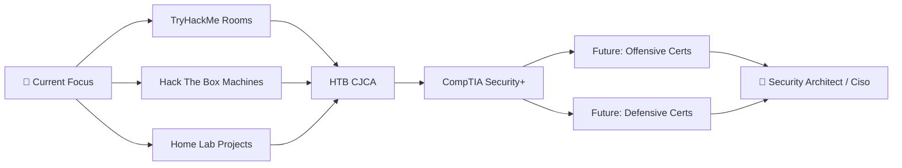

<div align="center">

# 🛡️ Flynn | Cybersecurity Enthusiast

### *Ethical Hacker in Training | Red Team Aspirant | Home Lab Warrior*


[](https://twitter.com/agentpuggles)
[](https://www.youtube.com/@agentpuggles)
[](https://discord.com/users/522543068872704010)
[](https://medium.com/@flynno)


</div>

---

## 🎯 About Me

> *"It takes 20 years to build a reputation and a few minutes of a cyber-incident to ruin it."*  
> **― Stéphane Nappo, Global CISO, Groupe SEB**

```python
class CyberSecurityEnthusiast:
    def __init__(self):
        self.name = "Flynn"
        self.alias = "Agentpuggles"
        self.role = "Ethical Hacker in Training"
        self.location = "Home Lab 🏠"
        self.currently_learning = [
            "Red/Blue Teaming",
            "Network Security", 
            "Coding Languages",
            "Computer Systems",
            "Offensive and Defensive techniques"
        ]
        self.interests = ["CTFs", "Penetration Testing", "Network Defense"]
        self.fun_fact = "Ubuntu was my first computer experience! 🐧"
        self.motto = "Hack the planet, but ethically! 🌍"
    
    def say_hi(self):
        print("Thanks for dropping by! Let's secure the digital world together 🔐")
    
    def current_mission(self):
        return "Building skills one box at a time 📦"

me = CyberSecurityEnthusiast()
me.say_hi()
```

---

## 🏆 Training Ground Stats

<div align="center">

### 🎮 TryHackMe Progress

<a href="https://tryhackme.com/p/Agentpuggles" target="_blank">

</a>

[](https://tryhackme.com/p/Agentpuggles)

---

### 📦 Hack The Box Profile

[](https://app.hackthebox.com/users/1519610)

<a href="https://app.hackthebox.com/users/1519610" target="_blank">

</a>

</div>

---

## 🚀 Current Focus

<div align="center">

<table>
<tr>
<td width="50%">

### 🔬 Building & Learning

* 🏠 Expanding my **Home Lab** infrastructure
* 📝 Writing **CTF Writeups** & documentation
* 🎓 Mastering **Red/Blue Team** tactics
* 🔍 Exploring **Network Security** architectures
* 🧪 Practicing on **TryHackMe** & **Hack The Box**
* 🐍 Developing **Python tools** for security testing

</td>
<td width="50%">

### 🤝 Collaboration Goals

* 🛡️ **Securing Home Labs** together
* 🌐 Sharing **CTF strategies** & solutions
* 💡 Learning from the **cybersecurity community**
* 🔗 Connecting with **like-minded hackers**
* 📚 Contributing to **open-source security tools**
* 🎯 Participating in **bug bounty programs**

</td>
</tr>
</table>

</div>

---

## 💻 Tech Arsenal

<div align="center">

### 🔐 Security & Penetration Testing


### 🐧 Operating Systems & Platforms


### 💾 Languages & Scripting


### 🎨 Creative & Cloud Tools


</div>

---

## 📊 GitHub Analytics

<div align="center">


</div>

<div align="center">


</div>

<div align="center">


</div>

---

## 🎓 Certifications & Learning Path

<div align="center">



</div>

### 🎯 Current Certification Goals

<div align="center">

**🔥 Primary Focus: HTB Certified Junior Cybersecurity Associate (HTB CJCA)**  
📊 Progress: **14.5%** | 📚 Status: Completing required modules

</div>

### 🏅 Certification Roadmap

<table>
<tr>
<td width="33%">

#### 📍 **Immediate Goals**
- 🎯 **HTB CJCA** (In Progress)
  - Cybersecurity Assessment Certification
  - Current: 14.5% Complete
- 🛡️ **CompTIA Security+**
  - Foundation for advanced certs

</td>
<td width="33%">

#### 🔴 **Future: Offensive Track**
- 🎯 **OSCP** (Offensive Security Certified Professional)
- 🔒 **PNPT** (Practical Network Penetration Tester)
- 🔥 **CRTP** (Certified Red Team Professional)

</td>
<td width="33%">

#### 🔵 **Future: Defensive Track**
- 🛡️ **CEH** (Certified Ethical Hacker)
- 🔒 **CySA+** (Cybersecurity Analyst)
- 🧱 **Blue Team Level 1**

</td>
</tr>
</table>

---

## 💬 Let's Connect

<div align="center">

**Ask me about:** CTFs | Penetration Testing | Ethical Hacking | Linux | Network Defense | Home Labs

📧 **Discord:** Agentpuggles
📝 **Medium:** [@flynno](https://medium.com/@flynno)
🐦 **Twitter:** [@agentpuggles](https://twitter.com/agentpuggles)
📺 **YouTube:** [@agentpuggles](https://www.youtube.com/@agentpuggles)

</div>

---

## 📈 Recent Activity

**🔥 What I've Been Working On:**

- 📦 **Completing Hack The Box machines** - Sharpening my penetration testing skills and completing fun boxes
- 🖥️ **Securing Proxmox infrastructure** - Hardening virtualization environment and implementing security best practices
- 🌐 **Network security for game servers** - Configuring firewalls, implementing DDoS protection, and securing hosting infrastructure
- 🏠 **Home lab expansion** - Building and testing new attack/defense scenarios in a controlled environment

<!--START_SECTION:activity-->
<!--END_SECTION:activity-->

---

<div align="center">

### 💭 Random Security Quote


---

*"The only truly secure system is one that is powered off, cast in a block of concrete and sealed in a lead-lined room with armed guards."* - **Gene Spafford**


</div>
